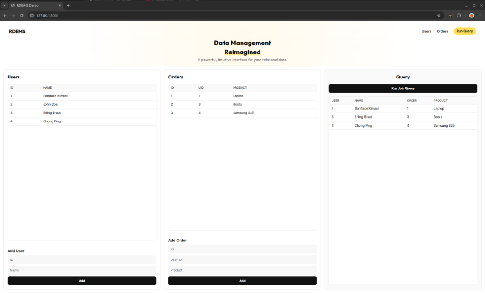

# RDBMS Demo Dashboard

A modern, web-based interface for visualizing a custom Relational Database Management System (RDBMS). This application allows valid SQL-like operations through a user-friendly dashboard.



## Features

- **User Management**: Add and view users in the database.
- **Order Tracking**: Create orders linked to users.
- **Query Visualization**: Execute join queries to analyze relationships between users and their orders.
- **Modern UI**: Single-view dashboard with a clean, responsive design.

## Tech Stack

- **Backend**: Python, Flask
- **Frontend**: HTML5, CSS3 (Glassmorphism & Grid Layout)
- **Database**: Custom Python-based RDBMS engine

## Installation & Running

1. **Clone the repository** (if applicable)

2. **Set up the environment**:
   ```bash
   python3 -m venv venv
   source venv/bin/activate
   pip install flask
   ```

3. **Run the application**:
   Since the engine is in a sub-module, you need to set the python path:
   ```bash
   PYTHONPATH=engine python app.py
   ```

4. **Access the Dashboard**:
   Open your browser and navigate to: [http://127.0.0.1:5000](http://127.0.0.1:5000)
